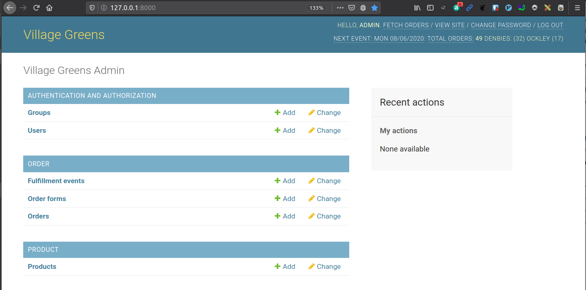

# farmbox

A Django 3 app (Python 3.8) for better workflow for farm shops that take in orders by xlsx. Currently, it aids fulfillment by producing a generated xlsx to better enable staff to pick and pack the produce.

This repo is to contain code for both `api` and `client`



## What's next ..
```
[ ] Plumbing in header metrics and tidy up
[ ] Order spreadsheets ingestion from Dropbox
[ ] Dockerizing / github actions deployment
[ ] Customer/Receipt sheets generation

[ ] Delivery management
[ ] Collection management

[ ] Separate customer model
[ ] State Machine
[ ] Order form generation from product model
[ ] Web Order Form

[ ] Invoice/Costing calculation
[ ] Stripe integration

[ ] Mobile app for picking management / updating order
```

## API

Prerequisites

* Python3 virtual environment

Quickstart

1. Clone this repo
2. `cd api`
3. With the virtual environment activated, install the API dependencies

        pip install -r requirements.txt
4. Run the migrations

        ./manage.py migrate
3. Run the development server

        api $ ./manage.py runserver

4. Log in at with the default superuser credentials (admin/Evoke-Enduring8-Figurine):

        http://localhost:8000/admin/

5. There are a few tests scattered around.
        
        (venv) ➜  api git:(master) ✗ ../venv/bin/pytest order/tests.py
        ============================================================== test session starts ==============================================================
        platform linux -- Python 3.8.0, pytest-5.4.1, py-1.8.1, pluggy-0.13.1
        django: settings: farmbox.settings (from ini)
        rootdir: /home/jon/code/playground/farmbox/api, inifile: pytest.ini
        plugins: factoryboy-2.0.3, django-3.9.0
        collected 7 items                                                                                                                               

        order/tests.py .......                                                                                                                    [100%]

        =============================================================== 7 passed in 0.94s ===============================================================
        
