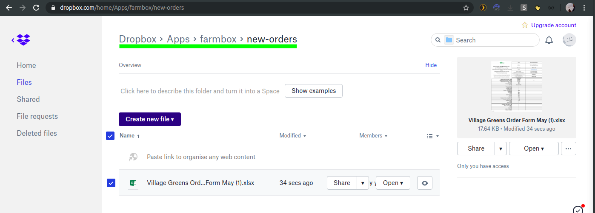

# farmbox


A Django 3 app for a more efficient workflow for food delivery organisations.

Currently supports order systems that take in orders by xlsx. It aids fulfillment by producing a generated xlsx to better enable staff to pick and pack the produce.

Example Workflow

1. The user uploads new order spreadsheets (xlsx) to the `new-orders` dropbox and initiates a `Fetch` operation in the Django Admin interface.

2. They are ingested by the system according to fulfillment event target date.
        - For example, if the xlsx cell has a _Deliver / Collection Date_ of 21st December 2020, the desired product quantities are read and the fulfillment event for 21/12/2020 is created.

3. Repeat orders forms do not need to be reingested from Dropbox. They can be duplicated to a new fulfillment event. See below where 3 orders are duplicated from 8th June event to 1st August event.


## Release History

* 2020.07.06
  - Fix: Customer sheet product headers ordering matches quantity
  - Fix: Parsing all words in last name is Sentence Case

* 2020.06.26
  - Restore db backup
  - Product sequence editing with adminsortable2 widget

* 2020.06.23
  - Customer order form parsing from Dropbox
  - Customer sheet generation (PDF/XLSX)
  - Static product selection #0 (< June 2020)
  - Duplicate order to new event as repeat


## Current Limitations

- No separate customer model. Cannot see all historical orders for a single customer

- Created repeat order forms do not currently take into account unpublished products


## What's next ..
```
==========================================
Phase 1
==========================================
[x] Creating the order from the sheet
[x] Plumbing in header metrics and tidy up
[x] Order spreadsheets ingestion from dropbox
[x] New product selection / May order form
[x] Deployment
[x] Customer sheets generation
[x] Duplicate order to a new Fulfillment Event
[ ] Receipts
        [ ] Invoice/Costing calculation
[ ] Dynamic Product listing
        [x] Allow user to modify product sequence using `adminsortable2` widget
                - https://github.com/jrief/django-admin-sortable2


## Bugs
- cleanup of /mediafiles if there is an uncaught reader exception

==========================================
Phase 2
==========================================
[ ] User groups
[ ] Multi-tenancy
[ ] Web Order Form
[ ] Stripe integration
        [ ] Delivery management
        [ ] Customer Collection management
        [ ] Separate customer model
        [ ] State Machine
        [ ] Order form generation from product model

==========================================
Phase 3
==========================================
[ ] Mobile app for picking management / updating order
```
---
## To start project yourself, you'll need:

* Access to the linked dropbox account

* To save new order forms to the following dropbox folder:
        - 

## API

Prerequisites

* Python==3.8
* Environment variables:

        export FARMBOX_DROPBOX_ACCESS_TOKEN=CHANGEME
        export DEFAULT_SUPERUSER_EMAIL=CHANGEME
        DEFAULT_SUPERUSER_PASSWORD=CHANGEME
        export DEFAULT_SUPERUSER_PASSWORD=CHANGEME
        DEBUG=1
        DJANGO_ALLOWED_HOSTS='localhost 127.0.0.1 [::1]'

### Quickstart

1. Clone this repo
2. `cd api`
3. With the virtual environment activated, install the API dependencies
        pip install -r requirements.txt
4. Run the migrations

        ./manage.py migrate
3. Run the development server

        api $ ./manage.py runserver

4. Log in at with the default superuser credentials (admin/Evoke-Enduring8-Figurine):

        http://localhost:8000/admin/

5. There are a few tests scattered around.

        (venv) ➜  api git:(master) ✗ ../venv/bin/pytest .
        ============================================================== test session starts ==============================================================
        platform linux -- Python 3.8.0, pytest-5.4.1, py-1.8.1, pluggy-0.13.1
        django: settings: farmbox.settings (from ini)
        rootdir: /home/jon/code/playground/farmbox/api, inifile: pytest.ini
        plugins: factoryboy-2.0.3, django-3.9.0
        collected 7 items

        order/tests.py .......                                                                                                                    [100%]

        =============================================================== 7 passed in 0.94s ===============================================================
